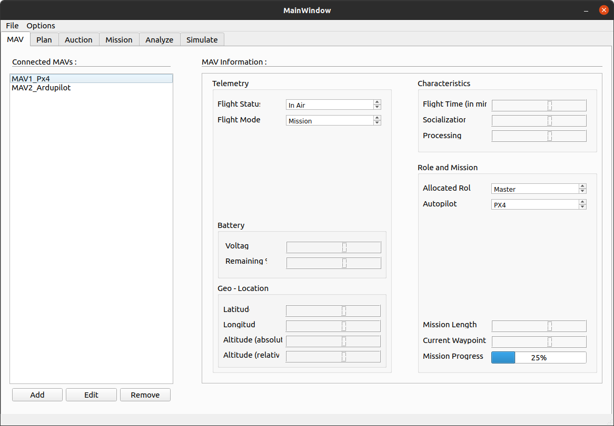

## About the project 
Desktop application designed to test distributed communication protocols with heterogeneous SITL-MAVs.


### Built with

* [MAVSDK python](https://mavsdk.mavlink.io/main/en/)
* [PyQt5](https://www.riverbankcomputing.com/static/Docs/PyQt5/)
* [SPADE](https://spade-mas.readthedocs.io/en/latest/readme.html)
* [SPADE_BDI](https://github.com/javipalanca/spade_bdi)
* [SPADE_PubSub](https://spade-pubsub.readthedocs.io/en/latest/)
* [Prosody XMPP server](https://prosody.im/doc/xmpp)
* [AgentSpeak(L)](http://astralanguage.com/wordpress/docs/introduction-to-agentspeakl/)
* [ZeroMQ](https://zeromq.org/)
* [Matplotlib](https://matplotlib.org/)

## Getting Started

This is an example of how you may set up this project locally and run the simulation of 5 MAV agents. To get a local copy up and running follow these simple steps.

> Ensure `python 3.6` or greater is installed on the host PC. Testing has been done with `python 3.8` and `pip 20.0.2`
### Prerequisites

1. Install [prosody](https://prosody.im/download/start) XMPP server
```bash
sudo apt-get install prosody
```

2. Install [PX4-Firmware]() and Toolchain

```bash
git clone https://github.com/PX4/PX4-Autopilot.git --recursive
bash ./PX4-Autopilot/Tools/setup/ubuntu.sh
```
### Installation

1. Clone the github repository
```bash
git clone https://github.com/KritinMathur/SPADE_BDI_UAV.git
```
> Creating a virtual environment is advisable. Click [here](https://docs.python.org/3/library/venv.html) to know more about setting up virtual environments.
2. Install the required packages

```bash
pip install -r requirements.txt
```
> In case the above command throws an error. You can alternatively install the list of core packages directly by executing the following command.
```bash
pip install numpy
pip install spade
pip install spade_bdi
pip install spade_pubsub
pip install pyzmq
pip install mavsdk
pip install pyqt5
pip install pyqt5-tools
pip install aioconsole
pip install matplotlib
```
3. Install pyqt5 webengine 
```bash
sudo apt install python3-pyqt5.qtwebengine
```
### Server setup

1. Execute the following commands to register the 5 agents in the prosody server

> sudo prosody register **user_name** **server_address** **password**

```
sudo prosodyctl register test localhost password
sudo prosodyctl register test2 localhost password
sudo prosodyctl register test3 localhost password
sudo prosodyctl register test4 localhost password
sudo prosodyctl register test5 localhost password
sudo prosodyctl register gcs localhost password
```


2. Edit server config file in `nano`

```bash
sudo nano /etc/prosody/prosody.cfg.lua
```

3. Add the following line of code at the botttom of the server config file

```lua
Component "pubsub.localhost" "pubsub"
```

4. Add the *test* agent as an admin by modifying the empty *admins* set accordingly in the server config file

```lua
admins = {"test@localhost"}
```

5. Save and exit the server config file using **'ctrl + x'** , press **'y'** to confirm change and **'enter'** to save the changes. 


> Ensure that the `virtual environment` is sourced before executing the following command.

6. Execute `setup.py` to create pubsub nodes

```bash
cd path/to/SPADE_BDI_UAV
python3 src/setup.py
```

## Usage

### Starting server and GUI
1. Start prosody server
```
sudo service prosody start
```

2. Give RWE permission to all files in `/src`
```bash
cd path/to/SPADE_BDI_UAV
chmod -r 777 ./src/
```


> Ensure that the `virtual environment` is sourced before executing the following command.

3. Start the `GCS GUI` by executing the following command on another terminal

```bash
cd path/to/SPADE_BDI_UAV
python3 src/GCS_gui.py
```
### Starting SITL
1. Perform the following actions in the GUI to start SITL
   - Goto *edit* -> *set sim path* -> *PX4* and select the PX4 repository
   - Goto *simulation tab*, select the number of PX4 MAVs in the *manage SITL* panel and click *start simulation*

2. Start MAV Model for each simulated MAV on another terminal
> Ensure that the `virtual environment` is sourced before executing the following command.

```bash
cd path/to/SPADE_BDI_UAV
python3 src/MAV_model.py
```
```bash
cd path/to/SPADE_BDI_UAV
python3 src/MAV_model.py --name test2 --uav_add udp://:14541 --uav_port 50041 --mc_port 5556
```
```bash
cd path/to/SPADE_BDI_UAV
python3 src/MAV_model.py --name test3 --uav_add udp://:14542 --uav_port 50042 --mc_port 5557
```
```bash
cd path/to/SPADE_BDI_UAV
python3 src/MAV_model.py --name test4 --uav_add udp://:14543 --uav_port 50043 --mc_port 5558
```
```bash
cd path/to/SPADE_BDI_UAV
python3 src/MAV_model.py --name test5 --uav_add udp://:14544 --uav_port 50044 --mc_port 5559
```

### Simulating faults
1. Perform the following actions 
   > **For now**, Connect `QGC` to perform actions on the MAV agents (e.g. takeoff ,do_mission ,goto_location)
   - Goto *simulation tab*, select the desired MAV and fault in the *fault simulation* panel
   - Click *set* to simulate the fault


## Roadmap

- [ ] Sprint 1 - Simulation Environment
  - [x] BDI Controller
  - [x] State, Neighbour, waypoint register
  - [x] Inter-MAV communication
  - [x] Defined Heterogeneity
  - [x] Basic function - RTL, Mission, Takeoff.
  - [x] SITL PX4
  - [ ] SITL ArduPilot
- [x] Sprint 2 - Multi-Agent Architecture
  - [x] FIPA protocol
  - [x] Role in society
  - [x] Communication restriction
  - [x] Record labels and warning
  - [x] Registering transactions
  - [x] Record and label of transactions
- [x] Sprint 3 - Coverage MissionPlan
  - [x] Ground station auction
  - [x] Ground station controller
  - [x] Mission Log
  - [x] Telemetry & Characteristics of MAV on GCS 
  - [x] Mission Upload
- [ ] Sprint 4 - Fault simulation
  - [x] Behaviors on faults
  - [x] 6 possible faults/failures
  - [ ] Communication with neighbour during fault
- [x] Sprint 5 - Desktop Application
  - [x] Connect multiple SITL instances
  - [x] Auction method integration
  - [x] Read state of MAV in RT
  - [x] Simulate faults UI
  - [x] Visualize Missions
  - [x] Export/View logs
- [ ] Final Documentation
  - [ ] Tests and Documentation of BDI
  - [ ] Tests and Documentation of SITL
  - [ ] Tests and Documentation of Transactions
  - [x] Tests adn Documentation of Auction method
  - [ ] Tests and Documentation of Faults
  - [ ] Tests and Documentation of GUI
  - [x] Interim project video documentation 
  - [ ] Full documentation of source code simulation and desktop application
- [ ] Extra Features
  - [ ] MAP based BDI coloring of MAV agents
  - [ ] MAP based FIPA message demonstration   


